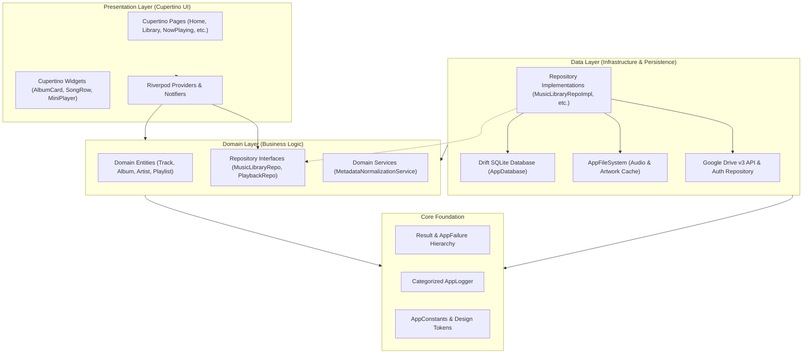

# Musii Architectural Specification

## Overview

Musii is constructed using strict **Clean Architecture** principles and **Domain-Driven Design (DDD)** patterns. The codebase is organized to maintain complete separation between domain business rules, external data providers, and UI presentation components.



---

## Architectural Layers

### 1. Core Layer (`lib/core/`)
Provides application-wide foundational primitives:
- **Functional Result Type (`lib/core/result/result.dart`)**:
  - Sealed class `Result<S, F>` with subtypes `Success<S, F>` and `Failure<S, F>`.
  - Enables pure functional pipeline handling (`fold`, `map`, `mapFailure`, `dataOrNull`, `failureOrNull`) without unexpected uncaught runtime exceptions.
- **Domain Failure Model (`lib/core/error/failures.dart`)**:
  - Sealed class `AppFailure` with explicit sub-failures: `AuthenticationFailure`, `DriveApiFailure`, `DriveFileNotFoundFailure`, `CacheFailure`, `CacheExceededFailure`, `DatabaseFailure`, `PlaybackFailure`, `NetworkFailure`, `MetadataExtractionFailure`.
  - Captures message, stack trace, HTTP status codes, and optional underlying cause.
- **Structured Categorical Logger (`lib/core/logging/app_logger.dart`)**:
  - Tags logs under dedicated categories: `auth`, `drive`, `sync`, `cache`, `playback`, `database`, `ui`.
  - Automatically sanitizes OAuth tokens, authorization headers, and sensitive tokens from log messages.
- **Design Tokens & Constants (`lib/core/constants/app_constants.dart`)**:
  - Strict radii (`AppRadii`), spacing (`AppSpacing`), audio constants (`AppAudioConstants`), and dynamic greeting provider (`AppGreeting`).
- **File System & Cache Manager (`lib/core/filesystem/app_file_system.dart`)**:
  - Singleton managing internal application cache directories, tracks cache, artwork thumbnails cache, and `.partial` download staging.
  - Implements atomic file writes (downloading to `.partial` then renaming to target file).

### 2. Domain Layer (`lib/features/*/domain/`)
Encapsulates pure business entities and contracts:
- **Entities**: Independent of external libraries, databases, or frameworks.
  - `Track`, `Album`, `Artist`, `Genre` in `lib/features/library/domain/entities/music_entities.dart`.
  - `Playlist` in `lib/features/playlists/domain/entities/playlist.dart`.
  - `CacheEntry` in `lib/features/cache/domain/entities/cache_entry.dart`.
  - `PlayerStateSnapshot` in `lib/features/playback/domain/entities/playback_state.dart`.
- **Repository Interfaces**: Abstract contracts defining operations.
  - `MusicLibraryRepository`, `PlaybackRepository`, `GoogleDriveRepository`, `AuthRepository`, `CacheRepository`, `FavoriteRepository`, `RecentlyPlayedRepository`, `PlaylistRepository`, `SearchRepository`, `SettingsRepository`.
- **Domain Services**:
  - `MetadataNormalizationService`: Cleans raw audio tags, extracts track numbers, sanitizes artist alias variations ("Various Artists", "V/A"), generates SHA-256 artwork cache keys.

### 3. Data Layer (`lib/features/*/data/`)
Implements domain contracts with concrete technologies:
- **Drift SQLite (`lib/core/database/app_database.dart`)**:
  - 18 relational tables with foreign keys and cascade rules.
  - Reactive `Stream` queries powering reactive Riverpod providers.
  - Dedicated `@DataClassName` annotations avoiding class collisions with domain entities.
- **Google Drive API (`lib/features/google_drive/data/`)**:
  - Authenticated REST calls using Google API client.
  - Recursive folder crawling with cycle detection and progress reporting.
  - Chunked byte-range downloading with resumption.
- **Audio Service Integration (`lib/features/playback/data/`)**:
  - Integrates `just_audio` with `audio_service` via `MusiiAudioHandler` extending `BaseAudioHandler` with `SeekHandler`.

### 4. Presentation Layer (`lib/features/*/presentation/`)
- **iOS Cupertino Design Aesthetic**:
  - `CupertinoPageScaffold`, `CupertinoNavigationBar`, `CupertinoTabBar`, `CupertinoActionSheet`, `CupertinoAlertDialog`.
  - High-fidelity typography with negative tracking, Cupertino system colors, and SF-style blurred backgrounds (`BackdropFilter`).
- **State Management via Riverpod 3**:
  - Immutable dependency injection via `Provider`, `StreamProvider`, `FutureProvider`, and `NotifierProvider`.
  - No `setState` spaghetti across feature boundaries.

---

## Data Flow Pipeline

### Library Synchronization Flow
```
User selects Drive Folder
        │
        ▼
GoogleDriveRepository.listAudioFilesRecursively()
        │
        ▼
MusicLibraryRepository.syncLibrary()
        │
        ├─► Diffs against existing Drift SQLite tracks
        ├─► Identifies new, modified, and deleted files
        ├─► Downloads byte range header (first 512KB) or reads stream
        ├─► MetadataExtractor extracts ID3 / Vorbis tags + embedded art
        ├─► MetadataNormalizationService canonicalizes tags & artwork key
        ├─► Persists to AppDatabase (tracks, albums, artists, artwork)
        └─► Emits SyncProgress to UI via StreamProvider
```

### Audio Playback Flow
```
User taps Track in UI
        │
        ▼
PlaybackRepository.playTrack(track)
        │
        ▼
MusiiAudioHandler.playMediaItem(mediaItem)
        │
        ├─► Check CacheRepository: Is track cached locally?
        │       ├─► YES: Load AudioSource.file(localPath)
        │       └─► NO: Stream AudioSource.uri(driveDownloadUri) + background cache download
        ├─► JustAudio player begins streaming/decoding
        ├─► AudioService updates Android MediaNotification & lock screen controls
        ├─► AudioSession handles focus (ducks or pauses on calls)
        ├─► Record playback history in RecentlyPlayedRepository
        └─► Increment play count and update LastPlayed timestamp in Drift
```
