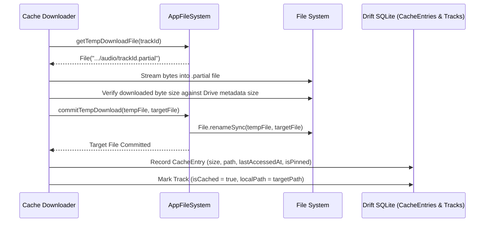

# Atomic Local Caching & Eviction Pipeline

Musii uses an offline-first storage and caching architecture to ensure seamless playback regardless of network conditions.

---

## 1. Directory Structure

All cache files are stored within the application's internal cache directory:

```
<cacheDir>/
├── audio/
│   ├── track_abc123.mp3
│   ├── track_xyz789.flac
│   └── track_part_temp.partial      # Temporary in-progress download
├── artwork/
│   ├── a1b2c3d4e5f6...jpg           # Deterministic SHA-256 hash of album + artist
│   └── 9876fedcba...png
└── staging/
    └── metadata_temp.bin
```

---

## 2. Atomic Two-Stage Download Pipeline

To prevent corrupted or half-downloaded audio files from entering the playback pipeline, Musii enforces a strict two-stage commit process:



### Safety Invariants:
1. If the network drops or the app is killed during download, only the `.partial` file remains.
2. During app bootstrap (`AppFileSystem.cleanupOrphanedFiles()`), all dangling `.partial` files older than 24 hours are removed.
3. No `.partial` file is ever passed to `just_audio`.

---

## 3. Least Recently Used (LRU) Eviction

Musii maintains a configurable cache quota (default 2 GB; adjustable in Settings between 500 MB and 10 GB).

### Eviction Algorithm:
1. When new audio is written, `CacheRepositoryImpl` evaluates:
   ```
   currentCacheSize + incomingFileSize > maxCacheSizeBytes
   ```
2. If total size exceeds capacity:
   - Queries `CacheEntries` where `isPinned = false`.
   - Orders rows by `lastAccessedAt ASC` (oldest access first).
   - Deletes audio files from disk and removes rows from `CacheEntries`.
   - Updates `Tracks` table (`isCached = false, localPath = null`).
   - Repeats until current size is below 85% of quota (providing a 15% eviction buffer to prevent immediate thrashing).

---

## 4. Offline Pinning

Users can explicitly "Pin" songs, albums, or playlists for offline listening:

- Pinned tracks set `isPinned = true` in `CacheEntries` and `isPinnedOffline = true` in `Tracks`.
- **Eviction Immunity**: The LRU eviction query explicitly filters out pinned tracks (`WHERE is_pinned = 0`).
- Pinned tracks are never evicted regardless of cache constraints.
- Users can unpin tracks via the Cupertino Track Overflow Sheet or the Settings page.
