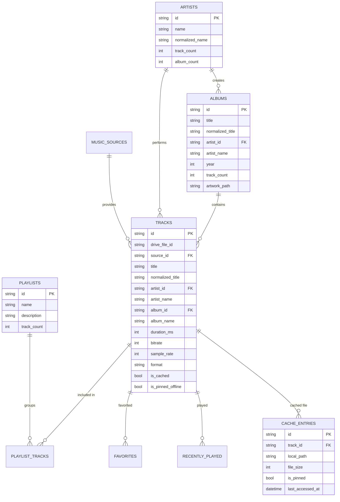

# Drift SQLite Database Specification

Musii relies on a relational local database managed by [Drift](https://drift.simonbinder.eu/) with the `sqlite3_flutter_libs` native bindings.

---

## 1. Schema Architecture & Tables

The schema comprises 18 tables and views located in `lib/core/database/tables.dart`:



### Complete Table List:
1. `MusicSources`: Google Drive accounts and configured root music folders.
2. `SyncRuns`: Audit trail of library synchronizations (timestamps, status, error messages).
3. `SyncFailures`: Granular log of files that failed during scan or tag extraction.
4. `Artists`: Canonical artist entities (`@DataClassName('ArtistRow')`).
5. `Albums`: Album collections with artwork references (`@DataClassName('AlbumRow')`).
6. `Tracks`: Complete track index with acoustic metadata and file properties (`@DataClassName('TrackRow')`).
7. `Genres`: Genre groupings (`@DataClassName('GenreRow')`).
8. `TrackGenres`: Many-to-many junction between tracks and genres.
9. `Playlists`: User-created playlists (`@DataClassName('PlaylistRow')`).
10. `PlaylistTracks`: Ordered junction linking playlists and tracks (`PlaylistTrack`).
11. `Favorites`: Favorited track identifiers with timestamps.
12. `RecentlyPlayed`: Playback session log with play counts and timestamps.
13. `CacheEntries`: Local audio cache ledger tracking file paths, sizes, and pinning status.
14. `ArtworkEntries`: Hash-keyed artwork thumbnails cache index.
15. `AppSettings`: Key-value configuration pairs (cache limits, theme mode, audio quality preferences).
16. `SearchIndex`: Normalized tokens for multi-entity searching.
17. `PlaybackQueue`: Persisted playback queue restoring active player state across app restarts.
18. `UserPreferences`: Local user settings and OAuth session metadata.

---

## 2. Naming Conventions & Drift Annotations

To prevent name collisions between Drift's generated row classes and our Clean Architecture domain entities (`Track`, `Album`, `Artist`, `Playlist`, `Genre`), all table definitions in `tables.dart` use the `@DataClassName` annotation:

```dart
@DataClassName('TrackRow')
class Tracks extends Table { ... }

@DataClassName('AlbumRow')
class Albums extends Table { ... }

@DataClassName('ArtistRow')
class Artists extends Table { ... }
```

Generated code resides in `lib/core/database/app_database.g.dart`.

---

## 3. Indexing & Reactive Queries

Key columns are indexed to ensure responsive UI performance even with libraries exceeding 50,000 songs:
- `tracks(drive_file_id)` (Unique lookups during sync)
- `tracks(normalized_title)` (Fast indexed search)
- `tracks(album_id)` (Instant album track rendering)
- `tracks(artist_id)` (Instant artist track rendering)
- `cache_entries(last_accessed_at)` (High-speed LRU eviction scanning)

All UI providers subscribe to reactive queries using Drift's `watch()` methods, ensuring that deletions, cache state updates, or playlist edits instantly re-render corresponding views without manual polling.
