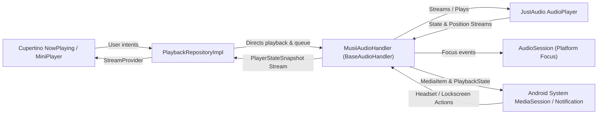

# Audio Playback Engine & Background Service Specification

This document details the audio playback pipeline, background service architecture, Android MediaSession integration, audio focus management, and queue mechanics in Musii.

---

## Architecture

Musii leverages `just_audio` as the low-level decoding and audio rendering engine, combined with `audio_service` for Android OS platform integration (Foreground Service, MediaSession, and lock screen media controls).



---

## 1. Foreground Service & Android Manifest

The audio playback service is declared in `android/app/src/main/AndroidManifest.xml`:

- **Permissions**:
  - `android.permission.FOREGROUND_SERVICE`
  - `android.permission.FOREGROUND_SERVICE_MEDIA_PLAYBACK` (Android 14+ requirement)
  - `android.permission.WAKE_LOCK`
  - `android.permission.INTERNET`
- **Service Declaration**:
  ```xml
  <service
      android:name="com.ryanheise.audioservice.AudioService"
      android:foregroundServiceType="mediaPlayback"
      android:exported="true">
      <intent-filter>
          <action android:name="android.media.browse.MediaBrowserService" />
      </intent-filter>
  </service>
  ```
- **Media Button Receiver**:
  ```xml
  <receiver
      android:name="com.ryanheise.audioservice.MediaButtonReceiver"
      android:exported="true">
      <intent-filter>
          <action android:name="android.intent.action.MEDIA_BUTTON" />
      </intent-filter>
  </receiver>
  ```
- **Activity Configuration**:
  `MainActivity` extends `AudioServiceActivity` to ensure seamless task switching and notification click intent routing.

---

## 2. Audio Focus & Session Management

Musii configures `audio_session` with standard music profile settings:

```dart
final session = await AudioSession.instance;
await session.configure(const AudioSessionConfiguration.music());
```

- **Interruption Handling**:
  - Incoming phone calls: Automatically pauses playback and resumes when call ends if active.
  - Navigation prompts / Siri / Assistant: Automatically ducks audio volume by -12dB and restores volume when the prompt completes.
- **Headphone Unplug ("Becoming Noisy")**:
  - Listens to `session.becomingNoisyEventStream` and pauses immediately to prevent accidental loudspeaker playback.

---

## 3. Playback Pipeline & Cache-Aware Sourcing

When a track is requested for playback:
1. **Cache Resolution**:
   - Checks `CacheRepository.getCacheEntry(track.id)`.
   - If the track is cached locally, `AudioSource.file(localPath)` is loaded directly into `AudioPlayer`.
   - If the track is not cached locally, an authenticated Google Drive streaming URL is loaded via `AudioSource.uri(...)`, and an asynchronous background cache job is triggered to download the track for future offline use.
2. **MediaItem Metadata Dispatch**:
   - An `audio_service.MediaItem` is dispatched with title, artist, album, track duration, and local file URI for artwork.
   - The Android MediaNotification automatically displays high-resolution cover art on the lock screen and notification shade.
3. **History & Play Counts**:
   - `RecentlyPlayedRepository.recordPlay(track.id)` is invoked.
   - Increment track play count and update `lastPlayedAt` in Drift SQLite.

---

## 4. Queue Lifecycle & Controls

The playback queue is maintained inside `MusiiAudioHandler` with index synchronization:

- **Play Single Track**: Replaces the queue or sets current index.
- **Play Album / Playlist**: Replaces queue with entire list and starts at index 0 or specified index.
- **Play Next**: Inserts track at `currentIndex + 1`.
- **Add to Queue**: Appends track to the end of the active queue.
- **Reorder Queue**: Moves items at `oldIndex` to `newIndex` with current index adjustment.
- **Repeat Modes**:
  - `AudioRepeatMode.off`: Play queue sequentially until end.
  - `AudioRepeatMode.all`: Loop entire queue continuously.
  - `AudioRepeatMode.one`: Loop current track continuously via `LoopMode.one`.
- **Shuffle Mode**:
  - Toggling shuffle preserves current track while randomizing remaining queue order.
